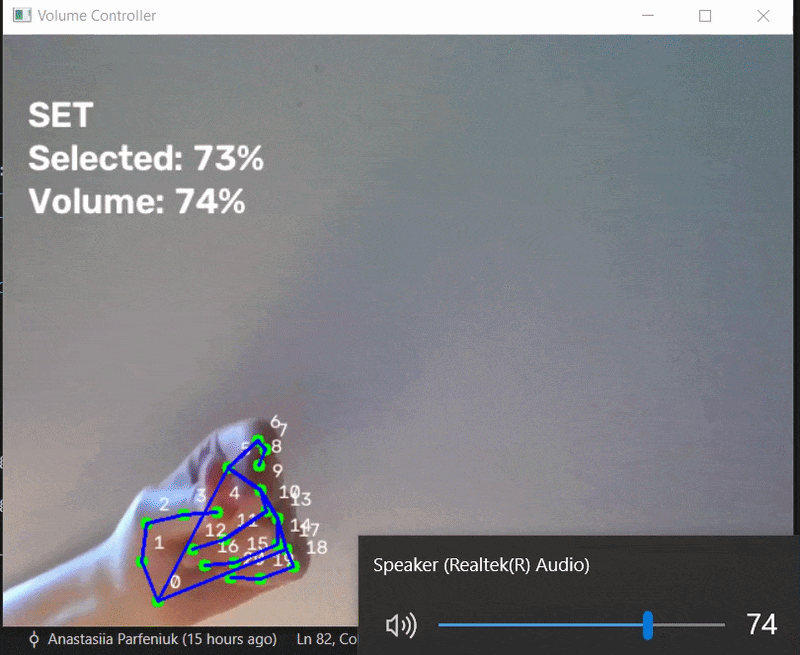

# Hand Gesture Volume Controller

Control your Windows system volume with hand gestures through your webcam. The app uses MediaPipe hand landmark detection, OpenCV video capture, and PyCAW to map the distance between your thumb and index finger to the system volume.




## Features

- Real-time hand tracking with MediaPipe.
- Volume control based on thumb-to-index distance.
- Pinch gesture to lock/set the selected volume.
- Smooth volume updates to avoid sudden jumps.
- On-screen feedback for current mode, selected volume, and applied volume.

## How It Works

The camera frame is passed to `HandTracker`, which returns MediaPipe hand landmarks. `volume_controller.py` reads the thumb tip and index fingertip positions, calculates the distance between them, and maps that distance to a 0-100% volume range.

There are three visible states:

- `SCROLL`: move thumb and index finger apart or closer to choose the target volume.
- `HOLD`: fingers are close enough that the app keeps the current selection.
- `SET`: pinch to commit the selected volume.

## Requirements

- Windows
- Python 3.10+
- Webcam
- Speaker/audio output device

This project uses PyCAW, which controls the Windows Core Audio API, so volume control is Windows-specific.

## Installation

Clone the repository:

```bash
git clone https://github.com/anastasiiaparfeniuk/hand-gesture-volume-controller.git
cd hand-gesture-volume-controller
```

Create and activate a virtual environment:

```bash
python -m venv .venv
.venv\Scripts\activate
```

Install dependencies:

```bash
pip install -r requirements.txt
```

## Usage

Run the app:

```bash
python volume_controller.py
```

Then use these gestures:

- Move your thumb and index finger apart to raise the volume.
- Move them closer together to lower the volume.
- Pinch your thumb and index finger to set the selected volume.
- Press `Esc` to close the app.

## Project Structure

```text
.
|-- assets/
|   `-- demo.gif
|-- models/
|   `-- hand_landmarker.task
|-- hand_tracker.py
|-- volume_controller.py
|-- requirements.txt
`-- README.md
```

## Creating a Real Demo GIF

To replace the illustrative GIF with a real recording:

1. Run `python volume_controller.py`.
2. Record a short clip showing the webcam window and the system volume changing.
3. Convert the clip to a GIF named `assets/demo.gif`.
4. Keep the GIF short, ideally 5-8 seconds, so it loads quickly on GitHub.

## Troubleshooting

- If the webcam does not open, check that no other app is using it.
- If volume does not change, make sure you are running on Windows and installed `pycaw`.
- If hand detection is unstable, use good lighting and keep one hand clearly visible in the frame.
- If the model cannot be loaded, confirm that `models/hand_landmarker.task` exists.

## License

This project is licensed under the MIT License. See [LICENSE](LICENSE) for details.
